<div align="center">
  
  <h1>EduFeedback</h1>
  <p><strong>Institute Feedback & Academic Communication SaaS Platform</strong></p>
</div>

<div align="center">

[](https://react.dev/)
[](https://capacitorjs.com/)
[](https://nodejs.org/)
[](https://www.mongodb.com/atlas)
[](https://tailwindcss.com/)
[](LICENSE)

</div>

An enterprise-grade, multi-department **Institute Feedback & Academic Communication SaaS Platform** with a companion **Native Android Mobile App**. Built with strict **Academic Data Isolation**, **Student Feedback Anonymity & Confidentiality Protection**, a **Native Dynamic Form Builder**, **Role-Based Access Control (RBAC)**, **Real-Time Analytics**, **Automated Attendance Monitoring**, and **Certified Institutional PDF Report Generation**.

---

## 🌟 Key Architecture & Highlights

1. **Web & Native Android Mobile App (Capacitor)**:
   - Full-stack responsive web application + companion native Android app (`.apk`).
   - Resilient multi-channel network engine with automatic endpoint auto-discovery (`adb reverse` USB bridge, local Wi-Fi, and emulator).
   - Profile Image & Avatar customizer with device upload and avatar presets.

1. **Multi-Department Academic Hierarchy & Data Isolation**:
   - Institutional structure: `Department → Course/Program → Class/Year → Semester → Subject → Teacher Assignment → Student → Response`.
   - Complete data isolation: MCA students and faculty never leak or cross-contaminate Commerce (B.Com) or Management (BBA) forms, attendance, or ratings.

2. **Strict Backend-Enforced Confidentiality Principle**:
   - **Student-to-Faculty Feedback is strictly confidential**: Teachers **cannot** see individual answers, student IDs, student names, or comments.
   - Teachers only receive aggregate submission metrics (`totalStudents`, `submittedCount`, `pendingCount`, `participationPercentage`).
   - Endpoint isolation: `GET /api/teacher/forms/:id/submission-status` is strictly limited, while raw responses on `GET /api/admin/forms/:id/responses` return `403 Forbidden` for non-admins.

3. **Native Dynamic Form Builder**:
   - 3-column workspace with a Question Types palette (Star Rating, 1-5 Rating Scale, 1-10 Numerical, Yes/No, MCQ, Checkboxes, Text, Long Remarks).
   - Academic scope targeting, live preview modal, draft and published states.

4. **1-Submission Per Student Rule**:
   - Compound index on `{ student: 1, form: 1 }` enforced at database level. Duplicate submissions return `409 Conflict`.

5. **Certified Institutional PDF Reports**:
   - Generates official IQAC accreditation-ready evaluation documents formatted with institutional letterheads, benchmark summaries, itemized question matrices, and signature blocks.

6. **Official Brand Color Palette**:
   - Primary Action & Brand: `#1DCED8` (Cyan)
   - Warm Background Accents: `#FFF9D8` (Cream)
   - Secondary Accent / Highlights: `#FF9D50` (Orange)
   - Success & Indicators: `#55E07E` (Green)

---

## 📸 Application Showcase & Screenshots

### 🔐 Authentication & Onboarding
| Portal Sign In (1-Click Personas) | Account Registration & Avatar Picker |
| :---: | :---: |
| 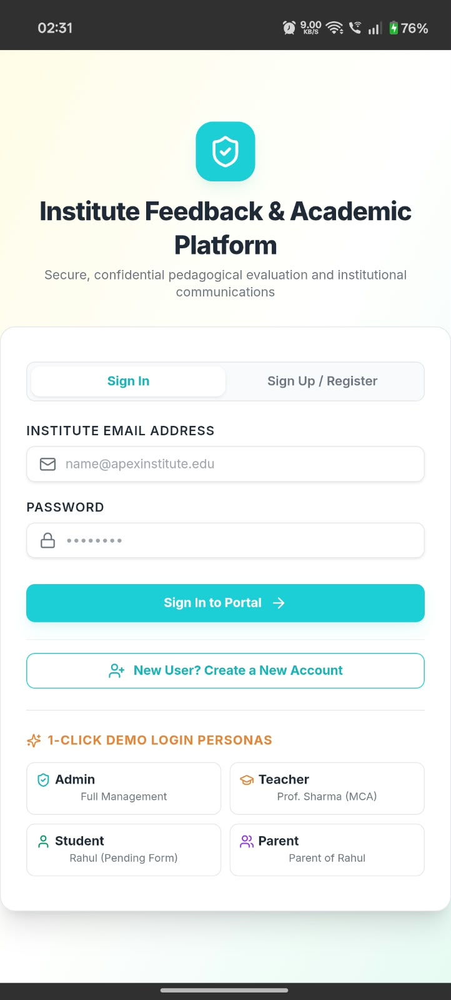 | 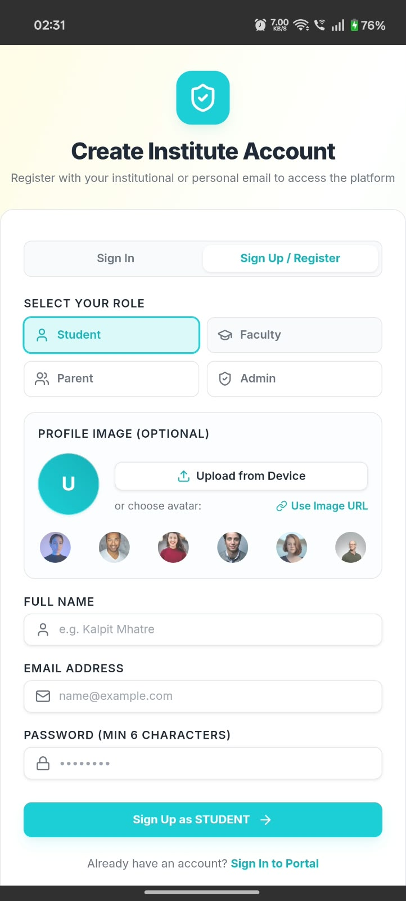 |

---

### 🏛️ Admin Intelligence & Dynamic Form Builder
| Multi-Department Analytics Dashboard | Dynamic Form Builder (Question Palette) |
| :---: | :---: |
| 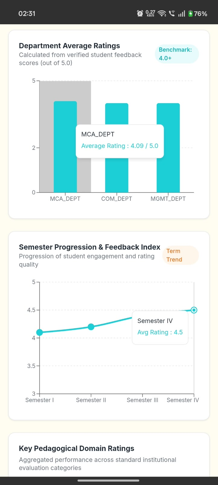 | 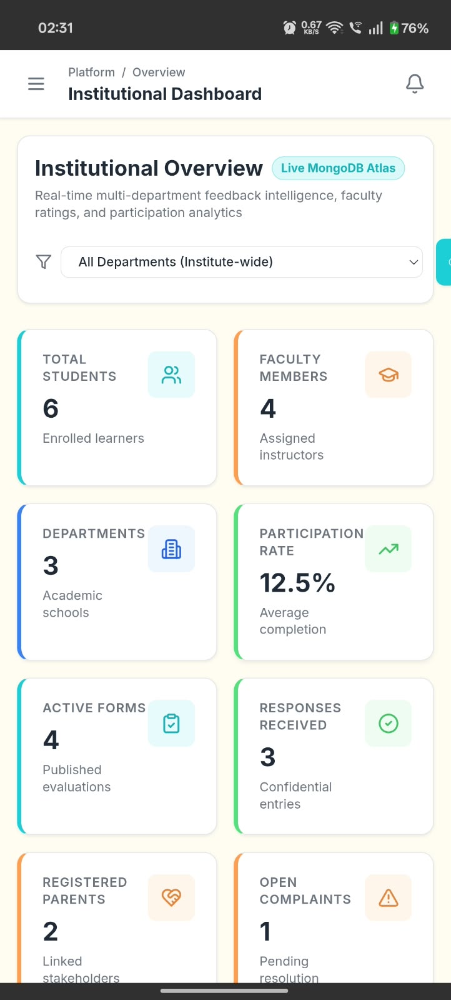 |

| Institutional Academic Hierarchy & People Directory |
| :---: |
| 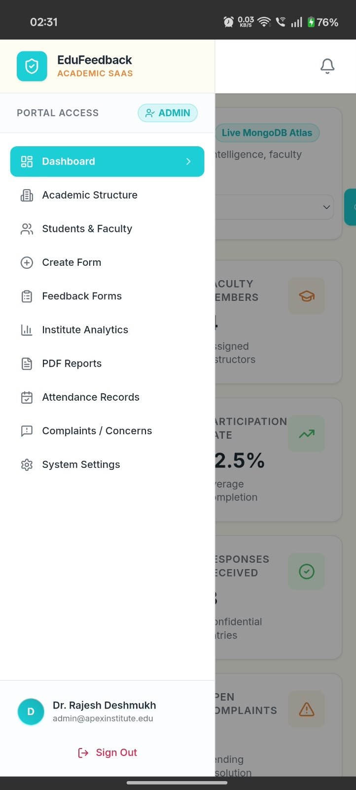 |

---

### 🎓 Student Feedback Portal & Evaluation
| Confidential Survey Form Filling | Star Ratings & Metrics |
| :---: | :---: |
| 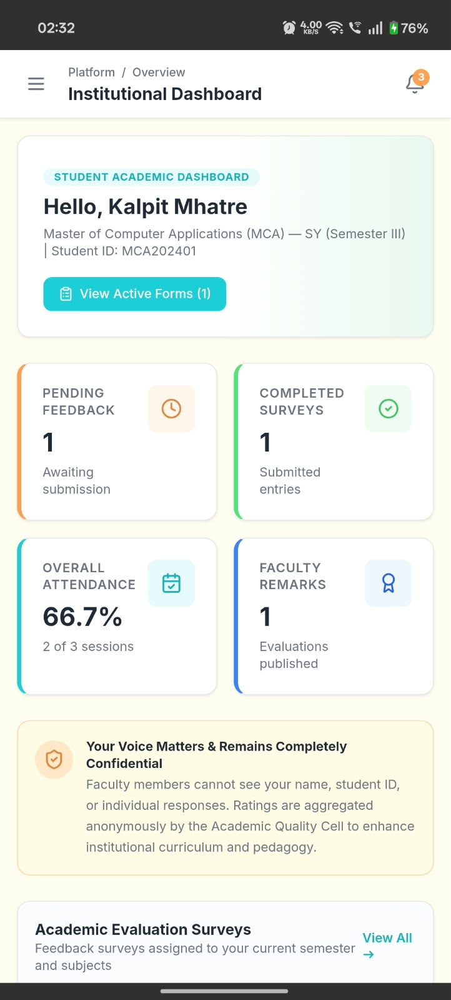 | 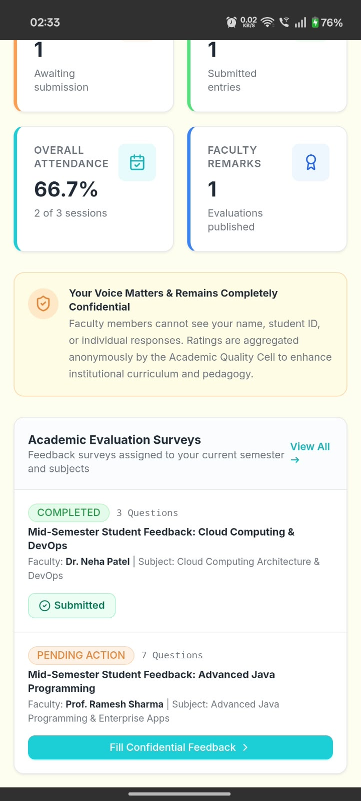 |

| Student Attendance Breakdown & Teacher Remarks |
| :---: |
| 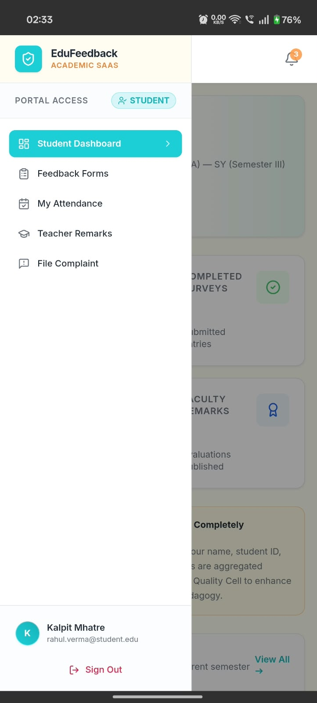 |

---

### 👨‍🏫 Faculty Portal & Confidential Tracking
| Faculty Dashboard & Participation Stats | Lecture Attendance Management |
| :---: | :---: |
| 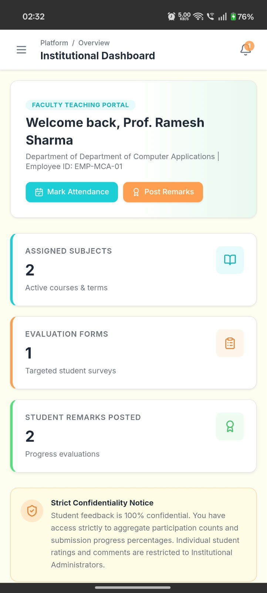 | 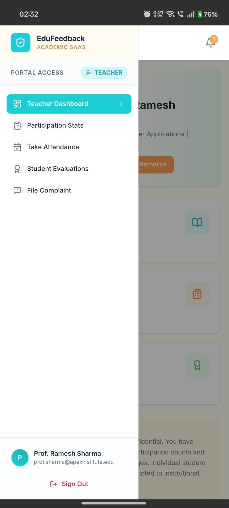 |

---

### 👨‍👩‍👧 Parent & Guardian Portal
| Ward Academic Performance & Evaluations | Institutional Grievance & Surveys |
| :---: | :---: |
| 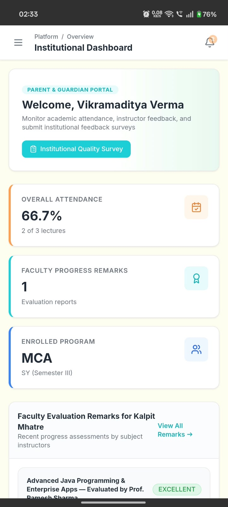 | 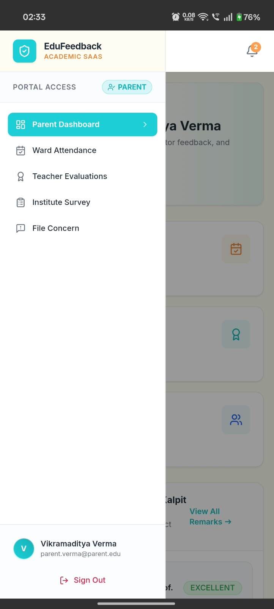 |

---

## 👥 User Roles & Permissions

| Role | Dashboard Experience | Permissions |
| :--- | :--- | :--- |
| **ADMIN** | Institutional Intelligence Dashboard | Full CRUD on Departments, Courses, Classes, Semesters, Subjects, Faculty, Students, Form Builder, Raw Responses, Analytics & PDF Reports |
| **TEACHER** | Faculty Teaching Portal | View assigned subjects, take attendance, post student progress remarks, view **confidential** aggregate feedback completion % |
| **STUDENT** | Student Academic Portal | Complete pending evaluation surveys, review attendance breakdown %, read teacher progress evaluations |
| **PARENT** | Parent & Guardian Portal | View child attendance records, read teacher progress assessments, file grievances, submit parent institutional surveys |

---

## ⚡ 1-Click Demo Logins

| Persona | Role | Email | Password |
| :--- | :--- | :--- | :--- |
| **Dr. Rajesh Deshmukh** | `ADMIN` | `admin@apexinstitute.edu` | `Admin@123` |
| **Prof. Ramesh Sharma** | `TEACHER` | `prof.sharma@apexinstitute.edu` | `Teacher@123` |
| **Rahul Verma** | `STUDENT` | `rahul.verma@student.edu` | `Student@123` |
| **Vikramaditya Verma** | `PARENT` | `parent.verma@parent.edu` | `Parent@123` |

*(The login screen also features 1-click quick-fill buttons for each persona!)*

---

## 🛠️ Technology Stack

- **Frontend**: React 18, Vite, TypeScript, Tailwind CSS, Lucide React, Recharts, jsPDF, jsPDF-AutoTable.
- **Backend**: Node.js, Express.js, TypeScript, RESTful API architecture, Zod validation, JWT, bcryptjs, Morgan.
- **Database**: MongoDB Atlas / Local MongoDB with Mongoose ODM, compound indexes, and aggregation pipelines.

---

## 🚀 Getting Started

### 1. Prerequisites
- Node.js (v18 or higher)
- MongoDB instance (local or MongoDB Atlas connection string)

### 2. Clone and Setup Environment Variables

Copy the template from `backend/.env.example` into `backend/.env`:
```bash
cp backend/.env.example backend/.env
```

Configure your environment variables in `backend/.env`:
```env
PORT=5000
MONGODB_URI=mongodb+srv://<username>:<password>@cluster0.example.mongodb.net/institute_feedback?retryWrites=true&w=majority
# Or for local MongoDB:
# MONGODB_URI=mongodb://127.0.0.1:27017/institute_feedback
JWT_SECRET=your_super_secret_jwt_key_here_change_in_production
CLIENT_URL=http://localhost:5173
NODE_ENV=development
```

### 3. Install Dependencies
```bash
# Install backend dependencies
cd backend
npm install

# Install frontend dependencies
cd ../frontend
npm install
```

### 4. Seed Realistic Demo Data
Populate multi-department academic structures, courses, faculty, students, attendance, forms, and responses:
```bash
cd backend
npm run seed
```

### 5. Run the Application
In separate terminal tabs:

**Terminal 1 (Backend API on http://localhost:5000):**
```bash
cd backend
npm run dev
```

**Terminal 2 (Frontend on http://localhost:5173):**
```bash
cd frontend
npm run dev
```

---

## 📡 REST API Reference

### Authentication
- `POST /api/auth/login` — Authenticate and retrieve JWT token.
- `GET /api/auth/me` — Retrieve active authenticated user profile.
- `PUT /api/auth/profile` — Update contact details and password.

### Academic Structure
- `GET /api/departments` & `POST /api/departments`
- `GET /api/courses` & `POST /api/courses`
- `GET /api/classes` & `POST /api/classes`
- `GET /api/semesters` & `POST /api/semesters`
- `GET /api/subjects` & `POST /api/subjects`
- `GET /api/teacher-assignments` & `POST /api/teacher-assignments`

### Users & Directory
- `GET /api/teachers` & `POST /api/teachers`
- `GET /api/students` & `POST /api/students`
- `GET /api/parents` & `POST /api/parents`

### Dynamic Forms & Confidential Responses
- `GET /api/forms` — List all forms with filters.
- `GET /api/forms/available` — Retrieve eligible forms for authenticated student.
- `POST /api/forms` — Create dynamic form with embedded questions.
- `POST /api/forms/:id/publish` & `POST /api/forms/:id/close`
- `POST /api/forms/:id/responses` — Submit confidential feedback response (enforces 1-submission rule).
- `GET /api/forms/:id/submission-status` — **Teacher Endpoint**: Returns strictly aggregate counts.
- `GET /api/forms/:id/responses` — **Admin Endpoint**: View itemized responses.

### Analytics & Reporting
- `GET /api/analytics/overview` — Multi-department institutional analytics.
- `GET /api/analytics/forms/:id` — Detailed question score distributions and benchmark ratings.

### Attendance & Remarks
- `GET /api/attendance` & `POST /api/attendance` — Log lecture session attendance.
- `GET /api/attendance/student/:studentId` — Calculate percentage and subject breakdown.
- `POST /api/teacher-feedback` & `GET /api/teacher-feedback/student/:studentId` — Student progress evaluations.

---

## 🛡️ Security & Privacy Architecture

- **Department Scoping**: Database queries verify `department`, `course`, `academicClass`, and `semester` parameters.
- **Strict Role Authorization**: Backend RBAC middleware rejects unauthorized attempts with `401 Unauthorized` or `403 Forbidden`.
- **Confidentiality by Design**: Individual student answers are never joined in teacher query pipelines.
- **Data Validation**: Every incoming payload is validated using Zod schemas with comprehensive type checking.

---

## 📄 License
This project is licensed under the MIT License.
